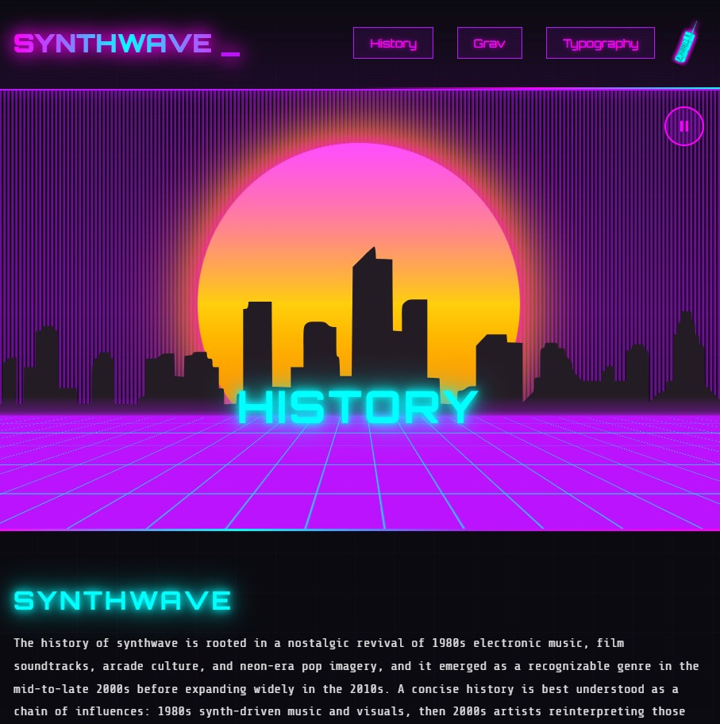

# Synthwave Theme



**Synthwave** is a retro 80s inspired neon synthwave theme for Grav CMS (tested on Grav 1.7.40, 1.8.0-beta.29 and 2.0.0-beta 1).

## Description

Retro 80s **Synthwave** Theme - A visually stunning theme featuring neon colors, animated synthwave aesthetics, and custom typography.

## Features

- Retro 80s synthwave aesthetic with neon colors (pink, cyan, purple, orange)
- Animated hero section with retro sun, perspective grid, and city skyline (customizable from the admin)
- Customizable logo (text or image)
- Google Fonts integration (Orbitron & Share Tech Mono)
- Custom scrollbar and form styling
- Background music support with play button and **persistent playback across page navigation**
  - done via AJAX'd the all website, can be disabled in case of issues in theme parameters.
- Fully responsive design
- **Mobile support**:
  - Fade-in menu with scale animation
  - Touch-friendly navigation
  - GPU-accelerated hero backgrounds
- **Quark-compatible page templates**:
  - Default, Item, Blog templates
  - Error page template
  - Modular templates (hero, text, features, gallery)
- **VHS effect**: Retro TV glitch effect with scanlines, noise, flicker, and chromatic aberration (can be enabled in settings)

## Installation

1. Download the theme as a ZIP file
2. Extract to `user/themes/synthwave`
3. Clear Grav cache
4. Set theme as default in system configuration

## Configuration

The theme can be configured through the Grav Admin Panel under **Theme > Synthwave**.

### Available Options

| Option | Type | Description |
|--------|------|-------------|
| Production Mode | Toggle | Enable production mode for optimized loading |
| Site Name | Text | Override the site name displayed in the header |
| Enable Logo Image | Toggle | Use an image as the logo instead of text |
| Logo Image File | File | Upload your logo image (SVG, PNG, etc.) |
| Background Music | File | Select an MP3 file as background music |
| Hide Play Button | Toggle | Hide the music play button in the hero |
| Enable AJAX Navigation | Toggle | Enable smooth page transitions without page reload - keeps music playing across pages (enabled by default, can be deactivated) |
| Enable VHS Effect | Toggle | Add retro VHS glitch effect overlay with scanlines, noise, flicker and chromatic aberration |
| Hero Decoration Style | Select | Choose decorative elements: Default (sun/city/grid), Custom Image, Custom Video, Custom Twig, or None |
| Hero Decoration Image | File | Upload custom background image to replace default decorations |
| Hero Decoration Video | File | Upload custom video to replace default decorations |
| Custom Twig Template | Text | Enter Twig template filename (e.g. "custom-hero.html.twig") to include from templates/partials/ |
| Hero Overlay | Toggle | Add dark overlay on custom hero media for better text readability |

## Usage

### Site Name
The default site name is "SYNTHWAVE". To change it:
1. Edit the Site Name field in the theme settings
2. Save and reload the page

### Logo Image
To use a custom logo image:
1. Enable "Enable Logo Image" toggle
2. Upload your logo (SVG, PNG, etc.) in the Logo Image File field
3. Save the page and refresh to see the changes
- Note: Upload the image first, **then** enable the toggle to avoid errors

### Background Music
To use your own background music:
1. Upload an MP3 file in the Background Music field
2. Save the page

```
Notes: 
Only one song can be stored. The default song "Midnight Pulse" is located in `assets/` folder.
To replace, delete the existing file first, save, then upload a new one and save again.
```

### Synthwave Modal Image

The theme automatically detects links ending with `?lightbox` and opens them in a synthwave modal instead of navigating to the image directly.

Example in Markdown:
```markdown
[Title of the image](image-name.png?lightbox)
```

### AJAX Navigation
When enabled, pages load without full refresh (music keeps playing). If pages don't load correctly or you see errors:
- Try disabling AJAX Navigation
- Clear browser cache
- Check browser console for JavaScript errors

### VHS Effect
Disabled by default. To enable:
1. Toggle "Enable VHS Effect" in settings
2. A sticky panel appears in bottom-right with effect checkboxes:
   - Scanlines
   - Noise
   - Flicker
   - Chromatic
3. Toggle individual effects on/off as needed

### Custom Hero Decoration
Replace the default synthwave decorations (sun, city, grid, sky) with custom media:

1. **Custom Image**: Select "Custom Background Image" in Hero Decoration Style, then upload an image
2. **Custom Video**: Select "Custom Background Video", then upload a video (mp4, webm, ogg)
3. **Custom Twig**: Select "Custom Twig", enter your template filename in the Custom Twig Template field
4. **No Decoration**: Select "None" for a clean background

The Hero Overlay toggle adds a dark layer over custom media for better text readability.

#### Custom Twig Template
Create a Twig file in `templates/partials/` (e.g., `custom-hero.html.twig`) and reference it in the theme settings. Available variables:
- `page` - Current page object (page.title, page.header.subtitle, etc.)
- `site` - Site configuration
- `theme_var('option')` - Access any theme setting

Example included: `custom-hero.html.twig`:
```twig
{# custom twig for hero #}
<div style="text-align: center;">
    <p>Custom HERO activated</p>
</div>
```

## Templates

Main synthwave theme templates are `default.html.twig` and `partials/base.html.twig`
Quark's base templates have been adapted in the `templates/` folder in both normal and modular versions.

## Pages in demo folder

- **History** - Landing page (synthwave genre history)
- **Theme** - Theme presentation and download links
- **Grav**  - About Grav CMS (disabled on the demo, kept for reference)
- **Typography** - Typography showcase
- **Contact** - Retro cellphone icon - Contact form with retro fax modem header

## To-Do

- Check the flickering of animation
- Better VHS effect
- Compatibilty with Quark 2 templates

## Requirements

- Grav CMS >=1.6.0 or higher
- Fully compatible with Grav 2.x

## Credits

- Theme by [Dr Droid](https://github.com/DrDroid-FR/)
- Email: gravdev@drdroid.fr
- Website: [https://github.com/DrDroid-FR/grav-theme-synthwave](https://github.com/DrDroid-FR/grav-theme-synthwave)
- Demo: [https://drdroid.fr/synthwave](https://drdroid.fr/synthwave)
- Song: "Midnight Pulse" by Dr Droid
- Inspired by: [to the future](https://codepen.io/propjockey/pen/VwKQENg) by Jane Ori a.k.a. [propjockey](https://propjockey.io/)
- Thanks to: Grav team for their amazing CMS

## License

MIT - See LICENSE file for details.

## Keywords

synthwave, retro, 80s, neon, theme, grav
